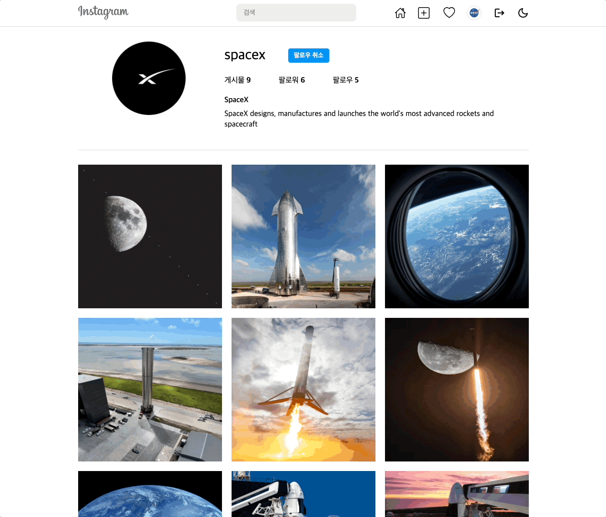
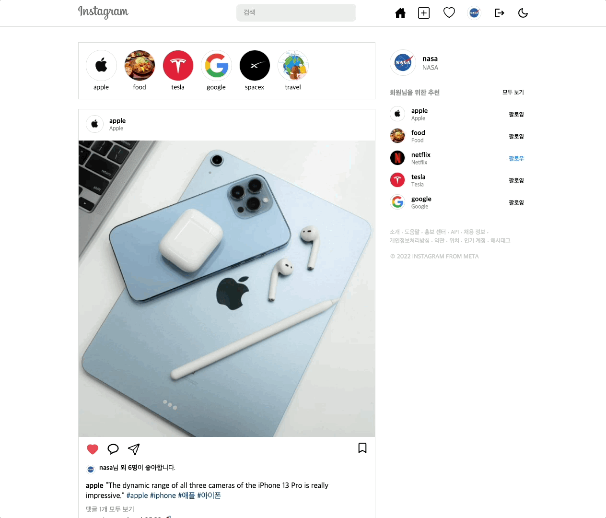

  
  <h2>Instagram Clone</h2>
  
📸 React · GraphQL · React Native 기반 풀스택 인스타그램 클론 (웹,앱,백엔드)

    
  

---

## ⚡️ Tech Stack
- **Frontend(Web/App)** : React, React Native, TypeScript, Apollo Client, Styled Components, Framer Motion  
- **Backend** : Node.js, Express, Apollo Server, GraphQL, Prisma, PostgreSQL, JWT  
- **Infra** : AWS S3, Heroku  
- **Mobile** : Expo, React Navigation  
- **Etc** : GraphQL Code Generator, PubSub  

---

## ✨ Features

- 👤 회원가입 / 로그인 / 프로필 / 팔로우·언팔로우  
- 📸 사진 업로드, 좋아요, 댓글, 해시태그 검색  
- 💬 DM, 채팅방, 실시간 팔로우 알림 (Subscriptions)  
- 🌙 다크모드 지원 (ThemeProvider)  
- 📱 Web / App 모두 동일한 UX 제공  

---

## 📸 Screenshots

  
  
  
  
  
  

---

## 🚀 Project Structure

- `frontend` : React + Apollo Client + Styled Components  
- `backend` : Apollo Server + Prisma + PostgreSQL  
- `app` : React Native + Expo  

## link
Front-end: https://github.com/hmchung2/instaclone-mobile

Back-end: https://github.com/hmchung2/instaclone-backend

App: https://github.com/hmchung2/instaclone-web

---
